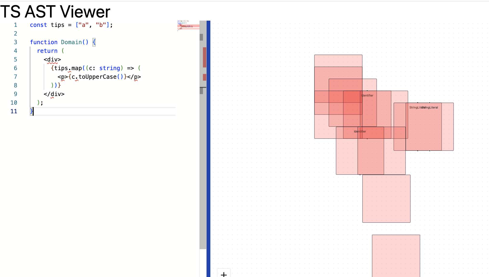

# Vite Starter

My preferred starting point for client only apps.

## Stack

Contains:

- Vite
- react-ts
- eslint rules around imports
  - Remove unused imports
  - Import sorting
  - Alias preferences: use `~` for `src`
- TailwindCSS
- Github actions to build pages
- `zustand` + `immer` for state management

## Attempts

### 2024-01-22 23:10:48

Using recast to parse the AST and babel to traverse it. Tried to use React Flow to group nodes together into nested boxes. It's not really coherent. Not sure if this should have produced something useful.

Will likely need to go after a proper nested boxes type layout instead of using the fancy graph approach.

